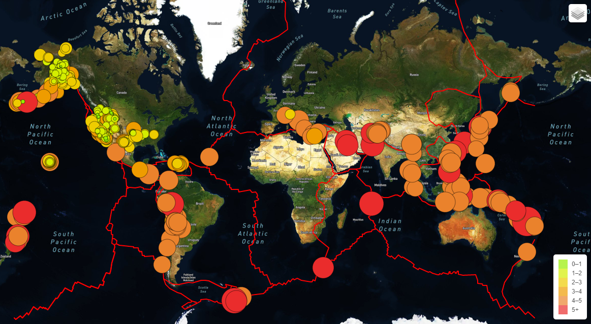

# Mapping_Earthquakes
The purpose of this project was to create a map with multiple different map options and overlays. The maps showe the  magnitude and location of earthquakes in relation to the earths tectonic plates.

This first image shows a map in street view with all 3 overlays active (earthquakes, tectonic plates, and major earthquakes).

This image shows the popup that appears when you click on an earthquake bubble. The popup displays the size and location of the earthquake.

Here you can see the map in satellite view.

Here is the map in dark view, which is the third and final map option.

This is what the map looks like with only the earthquake overlay selected. You can also see the popup in the top right corner for selecting which overlays you want displayed as well as which map option.

This is what the map looks like with only the tectonic plate overlay selected.

Finally, this is what the map looks like with only the major earthquake overlay selected where the red dots are earthquakes greater than magnitude 6, the yellow dots are earthquakes between magnitude 5 and 6, and the light green dots are earthquakes with magnitudes less than 5.

