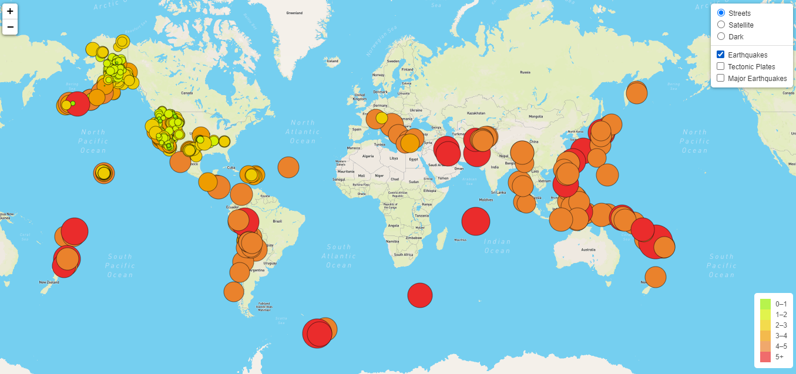

# Mapping_Earthquakes
The purpose of this project was to create a map with multiple different map options and overlays. The maps showed the  magnitude and location of earthquakes in relationn to the earths tectonic plates.

